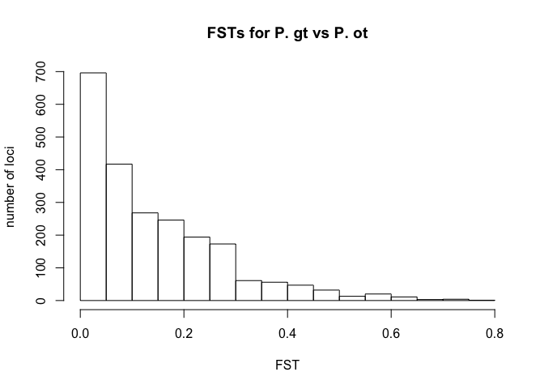
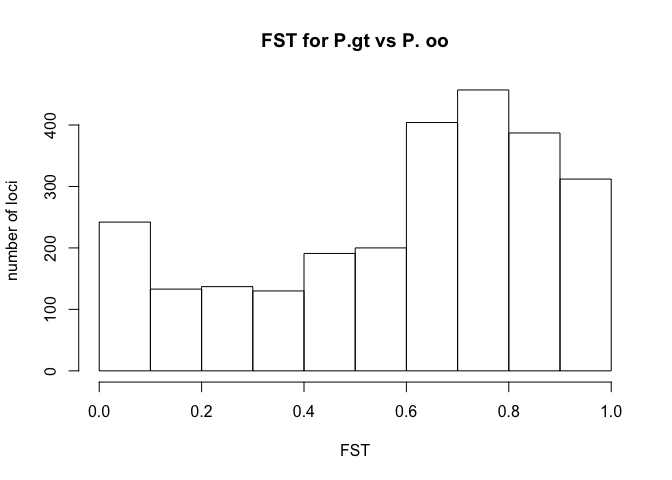
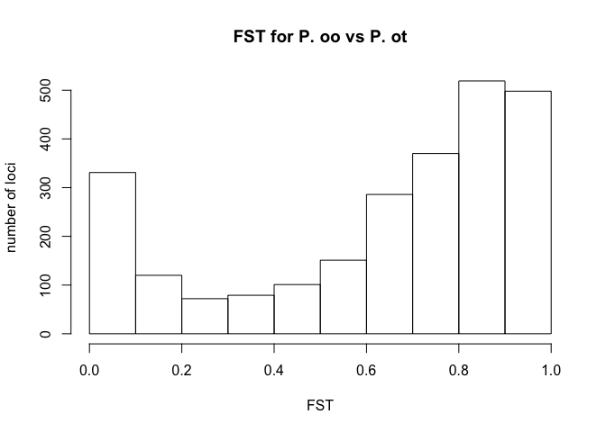
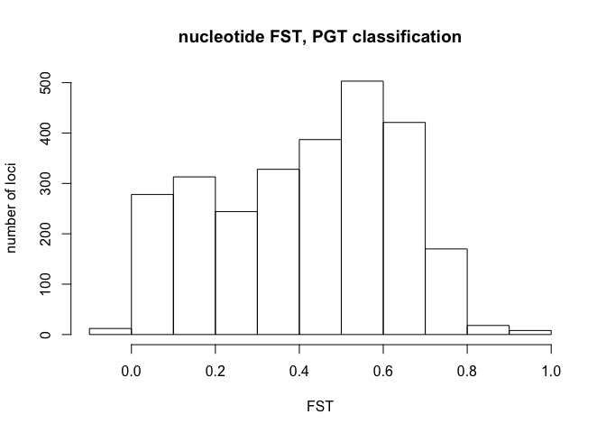
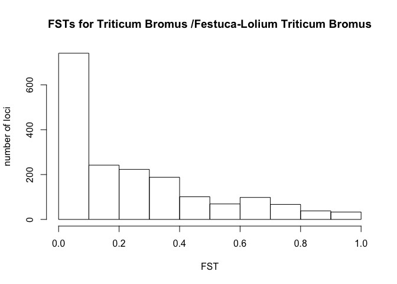
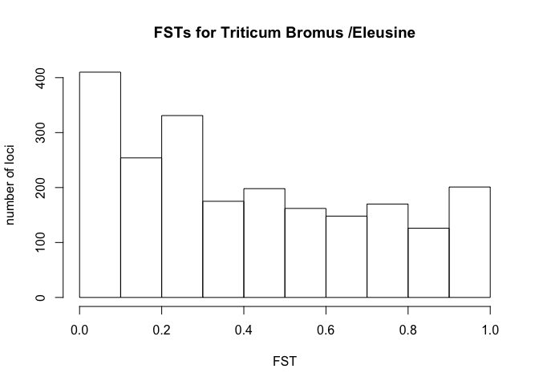
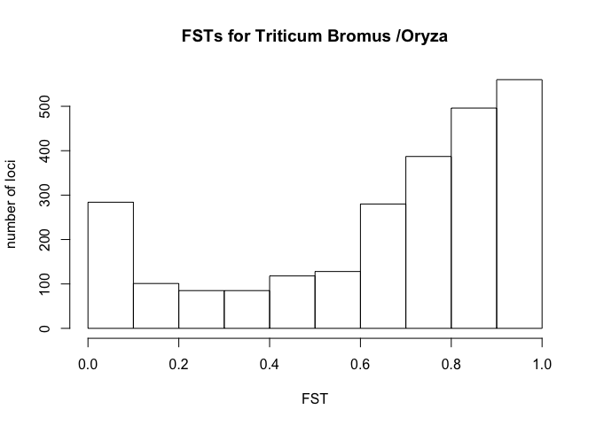
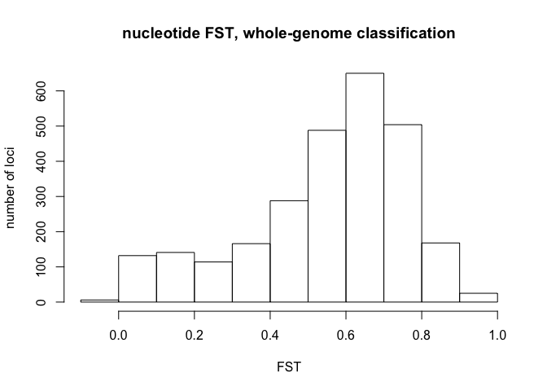

README
=======
Bradford Condon
Started 9-28-16
Last updated 1-16-17
Adapted from PopGenomeProject7-29-16

#Overview
**data**
* FASTA: FASTA alignment of conserved orthologs from all strains.  Recieved from Elisabeth Fournier
*  gList: master list of all strains included and their associated clade grouping (unfinished, waiting on confirmation)
* magnaporthe_phylogenomics_genomes2.xls: Human parseable data of gList and additional info.

**Current status:**
Figures generated for paper
Additional analyses not included in publication at this point, not finished past FST histograms.

**1-16-17 update**:
Strain classification cross-checked against most recent mapping.


#Results:
##Summary of loci (performed by collaborators)

Dataset 81 genomes
Number of single copy orthologs	2241
Number of single-copy orthologs with at least 1 informative site 2241

Dataset: 76 M. oryzae genomes
Number of single copy orthologs	2865
Number of single-copy orthologs with at least 1 informative site 2682

##Pretrimming data:
Unfortunately the FASTA headers have weird characters etc, and need to be parsed first.
Headers are as follows:

GRF52 MGG_17959T0_GRF52_scaffold00200.g7712.t1 GRF52_scaffold00200.g7712.t1
this is matched bythe regexp:

'\s.'
Although to get the newlines right, this is the right REGEXP:
 's/\s.*\n/\n/g'
and I wrote a simple script, cleanalignmentnames, in the bin folder.

Important consideration:  THere are three things.

* Host isolated from
* Host clade we assign to based on whole-genome distance
* PGT split 

#PGT split

Its possible that I really want to run Fstats seperately for our host clades, and then again for the PGT clades.

PGT strains are based on the MPG1 locus (see: Castroagudin, V. L., Moreira, S. I., Pereira, D. A. S., Moreira, S. S.,  P.C. Brunner, Maciel, J. L. N., et al. (2016). Pyricularia graminis-tritici sp. nov., a new Pyricularia species causing wheat blast.)

>MGG_10315T0
Protein ID:	114604
Location:	Supercontig_6.19:153468-154318

Unfortunately MGG_10315T0 is not in the filtered ortholog set. 10313, 10316 are.  

So instead, need to blast with this against all genomes, using the below command.


```r
perl bin/script3_Execute_BLAST.pl -i supporting/mpg1seed.fasta -w '/Users/chet/uky/popGenomeProject7-29-16/wholeGenome/'
perl bin/All_regions_from_blast_alt_9-15-16

#Then, align and trim
muscle3 -in MPG_all.fasta -out MPG_all_aligned.fasta
gblocks MPG_all_aligned.fasta -t=d -b5=n
```

Confusing results.  I'm left with 169/208 positions.  But most of those 169 positions are 100% identical across all strains.
Ah, of course, all of the differences in MPG1 are in the first 40 base pairs, which are what I'm excluding.

Using the ortholog alignment would be better, but for now, can discern MPG1 phenotype.


Below strains are *PGT* based on mPG1 locus.
*PGT*: 

B51
B71
BdBar
BdJes
BdMeh
CD156
CHRF
CHW
EI9411
EI9604
FH
G22
GG11
HO
LpKY97
P28
PGPA
PH42
PL2-1
PL3-1
PY0925
PY86-1
Pg1213-22
PgKY
WBKY11
Z2-1
Br62


#FST statistics


*assignments made without strong confdience:*
BR0032 -> TB
Br48 -> TB
PgPA18C-02 -> FLTB


```r
library("PopGenome")
```

```
## Loading required package: ff
```

```
## Loading required package: bit
```

```
## Attaching package bit
```

```
## package:bit (c) 2008-2012 Jens Oehlschlaegel (GPL-2)
```

```
## creators: bit bitwhich
```

```
## coercion: as.logical as.integer as.bit as.bitwhich which
```

```
## operator: ! & | xor != ==
```

```
## querying: print length any all min max range sum summary
```

```
## bit access: length<- [ [<- [[ [[<-
```

```
## for more help type ?bit
```

```
## 
## Attaching package: 'bit'
```

```
## The following object is masked from 'package:base':
## 
##     xor
```

```
## Attaching package ff
```

```
## - getOption("fftempdir")=="/var/folders/p2/25r02fld33qdr02n_gp25_pm0000gn/T//RtmptRsug2"
```

```
## - getOption("ffextension")=="ff"
```

```
## - getOption("ffdrop")==TRUE
```

```
## - getOption("fffinonexit")==TRUE
```

```
## - getOption("ffpagesize")==65536
```

```
## - getOption("ffcaching")=="mmnoflush"  -- consider "ffeachflush" if your system stalls on large writes
```

```
## - getOption("ffbatchbytes")==16777216 -- consider a different value for tuning your system
```

```
## - getOption("ffmaxbytes")==536870912 -- consider a different value for tuning your system
```

```
## 
## Attaching package: 'ff'
```

```
## The following objects are masked from 'package:bit':
## 
##     clone, clone.default, clone.list
```

```
## The following objects are masked from 'package:utils':
## 
##     write.csv, write.csv2
```

```
## The following objects are masked from 'package:base':
## 
##     is.factor, is.ordered
```

```r
library("ggplot2")
library("reshape")
library("knitr")
```

```
## Warning: package 'knitr' was built under R version 3.2.5
```

```r
 library(plyr)
```

```
## Warning: package 'plyr' was built under R version 3.2.5
```

```
## 
## Attaching package: 'plyr'
```

```
## The following objects are masked from 'package:reshape':
## 
##     rename, round_any
```

```r
setwd("/Users/chet/uky/popGenomeOrthologs9-28-16")
#read in aux functions
source("/Users/chet/uky/AllRFunctions/AuxFunctions.R")
```

```
## Warning: package 'ape' was built under R version 3.2.5
```

```
## Warning: package 'phytools' was built under R version 3.2.5
```

```
## Loading required package: maps
```

```
## Warning: package 'maps' was built under R version 3.2.5
```

```
## 
## Attaching package: 'maps'
```

```
## The following object is masked from 'package:plyr':
## 
##     ozone
```

```r
GENOME.class <- readData("alignments/", FAST=FALSE) #Read alignments
```

```
## |            :            |            :            | 100 %
## |===================================================| ;-)
```

```r
clade_list <- read.table(file = "supporting/clade_list_two_class.txt", header=TRUE, fill= TRUE)
kable(clade_list)
```


isolate      ID           species          hostGenus      SequenceProvider   MPG1_clade   WG_clade     
-----------  -----------  ---------------  -------------  -----------------  -----------  -------------
87_120.2     87-120       Moryzae          Oryza          Talbot-Soanes      PO.O         Oryza        
Arcadia      Arcadia      Moryzae          Setaria        Farman-Valent      other        Setaria      
B2           B2           Moryzae          Triticum       Farman-Valent      PO.T         TB           
B51          B51          Moryzae          Eleusine       Farman-Valent      PGT          Eleusine     
B71          B71          Moryzae          Triticum       Farman-Valent      PGT          TB           
Bd8401       Bd8401       Moryzae          Brachiaria     Farman-Valent      other        Brachiaria   
BdBar        BdBar        Moryzae          Triticum       Farman-Valent      PGT          TB           
BdJes        BdJes        Moryzae          Triticum       Farman-Valent      PGT          TB           
BdMeh        BdMeh        Moryzae          Triticum       Farman-Valent      PGT          TB           
Bm88324      Bm88324      Moryzae          Brachiaria     Farman-Valent      other        Brachiaria   
BR0032       BR0032       Moryzae          Triticum       Montpellier        PO.T         TB           
Br130        Br130        Moryzae          Bromus         Tom.Mitchell       other        TB           
BR29         BR29         Mgrisea          Digitaria      Montpelier         other        Digitaria    
Br48         Br48         Moryzae          Triticum       DDBJ               PO.T         TB           
Br58         Br58         Moryzae          Avena          DDBJ               other        FLTB         
BR62         Br62         Moryzae          Eleusine       Talbot-Soanes      PGT          Eleusine     
Br7          Br7          Moryzae          Triticum       Farman-Valent      PO.T         TB           
Br80         Br80         Moryzae          Triticum       Farman-Valent      PO.T         TB           
CD0156       CD156        Moryzae          Eleusine       Montpellier        PGT          Eleusine     
CHRF         CHRF         Moryzae          Lolium         Farman-Valent      PGT          FLTB         
CHW          CHW          Moryzae          Lolium         Farman-Valent      PGT          FLTB         
Dig41        Dig41        Mgrisea          Digitaria      DDBJ               other        Digitaria    
DsLIZ        DsLIZ        Mgrisea          Digitaria      Farman-Valent      other        Digitaria    
EI9411       EI9411       Moryzae          Eleusine       NCBI               PGT          Eleusine     
EI9604       EI9604       Moryzae          Eleusine       NCBI               PGT          Eleusine     
FH           FH           Moryzae          Lolium         Farman-Valent      PGT          FLTB         
FR0013       FR13         Moryzae          Oryza          Montpellier        PO.O         Oryza        
G17          G17          Moryzae          Eragrostis     Talbot-Soanes      other        Eragrostis   
G22          G22          Moryzae          Eleusine       Farman,.Valent     PGT          Eleusine     
GFSI1-7-2    GFSI1-7-2    Moryzae          Setaria        DDBJ               other        Setaria      
GG11         GG11         Moryzae          Lolium         Farman-Valent      PGT          FLTB         
GRF52        GRF52        Moryzae          Setaria        Farman-Valent      other        Setaria      
Grf5                                                                                                   
GY0011       GY11         Moryzae          Oryza          Montpellier        PO.O         Oryza        
HO           HO           Moryzae          Lolium         Farman-Valent      PGT          FLTB         
IA1          IA1          Moryzae          Oryza          Farman-Valent      PO.O         Oryza        
IB33         IB33         Moryzae          Oryza          Yulin.Jia          PO.O         Oryza        
IB49         IB49         Moryzae          Oryza          Farman-Valent      PO.O         Oryza        
IC17         IC17         Moryzae          Oryza          Farman-Valent      PO.O         Oryza        
IE1K         IE1K         Moryzae          Oryza          Farman-Valent      PO.O         Oryza        
INA168       INA168       Moryzae          Oryza          DDBJ               PO.O         Oryza        
KANSV1-4-1   KANSV1-4-1   Moryzae          Setaria        DDBJ               other        Setaria      
KEN53-33     Ken53-33     Moryzae          Oryza          DDBJ               PO.O         Oryza        
LpKY97       LpKY97       Moryzae          Lolium         Farman-Valent      PGT          FLTB         
ML33         ML33         Moryzae          Oryza          Farman-Valent      PO.O         Oryza        
P131         P131         Moryzae          Oryza          NCBI               PO.O         Oryza        
P2           P-2          Moryzae          Oryza          DDBJ               PO.O         Oryza        
P28          P28          Moryzae          Bromus         Farman-Valent      PGT          FLTB         
P29          P29          Moryzae          Bromus         Farman-Valent      other        TB           
P3           P3           Moryzae          Triticum       Farman-Valent      other        TB           
Pg1213-22    Pg1213-22    Moryzae          Lolium         Farman-Valent      PGT          FLTB         
PgKY4OV2.1   PgKY         Moryzae          Lolium         Talbot-Soanes      PGT          FLTB         
PgPA18C-02   PGPA         Moryzae          Lolium         Talbot-Soanes      PO.T         FLTB         
PH0014       PH0014-rn    Moryzae          Oryza          Montpellier        PO.O         Oryza        
PH42         PH42         Moryzae          Eleusine       Farman-Valent      PGT          Eleusine     
PL2-1        PL2-1        Moryzae          Lolium         Marc-Farman        PGT          FLTB         
PL3-1        PL3-1        Moryzae          Lolium         Farman-Valent      PGT          FLTB         
PM1          Pm1          Ppennisetigena   Pennisteum     Talbot-Soanes      other        Pennisteum   
PY0925       PY0925       Moryzae          Triticum       Talbot-Soanes      PGT          TB           
PY36.1       PY36-1       Moryzae          Triticum       Talbot-Soanes      PO.T         TB           
PY5003       PY5003       Moryzae          Triticum       Talbot-Soanes      PO.T         TB           
PY5010       PY5010       Moryzae          Triticum       Talbot-Soanes      PO.T         FLTB         
PY5033       PY5033       Moryzae          Triticum       Talbot-Soanes      PO.T         TB           
PY6017       PY6017       Moryzae          Triticum       Talbot-Soanes      PO.T         TB           
PY6045       PY6045       Moryzae          Triticum       Talbot-Soanes      PO.T         TB           
PY86.1       PY86-1       Moryzae          Triticum       Talbot-Soanes      PGT          FLTB         
SA05-43      SA05-43      Moryzae          Setaria        DDBJ               other        Setaria      
SSFL02-1     SSFL02       Moryzae          Stenotaphrum   Farman-Valent      other        Stenotaphrum 
SSFL14-3     SSFL14-3     Moryzae          Stenotaphrum   Farman-Valent      other        Stenotaphrum 
SV9610       SV9610       Moryzae          Setaria        NCBI               other        Setaria      
SV9623       SV9623       Moryzae          Setaria        NCBI               other        Setaria      
T25          T25          Moryzae          Triticum       Farman-Valent      PO.T         TB           
TF05-1       TF05-1       Moryzae          Lolium         Farman-Valent      PO.T         FLTB         
TH0012       TH12-rn      Moryzae          Oryza          Montpellier        PO.O         Oryza        
TH0016       TH16         Moryzae          Oryza          Montpellier        PO.O         Oryza        
TH3          TH3          Moryzae          Oryza          DDBJ               PO.O         Oryza        
US0071       US71         Moryzae          Setaria        Montpellier        other        Setaria      
VO107        VO107        Mgrisea          Digitaria      Talbot-Soanes      other        Digitaria    
WBKY11       WBKY11       Moryzae          Triticum       Farman-Valent      PGT          FLTB         
WHTQ         WHTQ         ?                ?              Tom.Mitchell       PO.T         TB           
Y34          Y34          Moryzae          Oryza          NCBI               PO.O         Oryza        
Z2-1         Z2-1         Moryzae          Eleusine       DDBJ               PGT          Eleusine     


#MPG1-based classification


```r
##
#part I: MPG1-based classifcation
##

PGT = as.character(clade_list[clade_list$MPG1_clade == 'PGT', 2])
POo = as.character(clade_list[clade_list$MPG1_clade == 'PO.O', 2])
POt = as.character(clade_list[clade_list$MPG1_clade == 'PO.T', 2])
notOther<- (clade_list[which(as.character(clade_list[,2]) %in% PGT |as.character(clade_list[,2]) %in%  POo|as.character(clade_list[,2]) %in%  POt),2])  ##Clunky way to code this, but we're taking all the remaining strains here
otherStrains<- as.character(clade_list[!clade_list$ID %in% notOther,2])

PGThypothesis <- set.populations(GENOME.class, list(PGT, POo, POt, otherStrains))  ##assign populations
```

```
## |            :            |            :            | 100 %
## |===================================================| ;-)
```

```r
PGThypothesis <- diversity.stats(PGThypothesis)
```

```
## |            :            |            :            | 100 %
## |===================================================| ;-)
```

```r
PGThypothesis <- F_ST.stats(PGThypothesis)
```

```
## nucleotide 
## |            :            |            :            | 100 %
## |===================================================| ;-) 
## 
## haplotype 
## |            :            |            :            | 100 %
## |===================================================| ;-)
```

```r
FSTpairwise<-get.F_ST(PGThypothesis ,mode=FALSE,pairwise=TRUE)
hapPairFST<- (FSTpairwise[[2]]) ##Choose haplotype pairwise FST (as opposed ot nucleotide)
fstbypomelt <- melt(hapPairFST)
colnames(fstbypomelt) <- c("locus", "comparison", "value")
fstbypomelt$comparison<- gsub("pop1", "P.gt", fstbypomelt$comparison)#rename populations to full pop assignments
fstbypomelt$comparison<- gsub("pop2", "P.oo", fstbypomelt$comparison)
fstbypomelt$comparison<- gsub("pop3", "P.ot", fstbypomelt$comparison)
fstbypomelt$comparison<- gsub("pop4", "P.other", fstbypomelt$comparison)

sum(is.na(fstbypomelt$value))  #how many NA?
```

```
## [1] 731
```

```r
noNAfstmelt<- fstbypomelt[!is.na(fstbypomelt$value),]#NAs ruin mean, remove
#replace negatives with zero.  Negative FST values are not meaningful.
noNAfstmelt$value[which(noNAfstmelt$value < 0)] <- 0


pdf(file = "whiskerPlot_all_FST_values.pdf" , 8.5, 11)
p <- ggplot(noNAfstmelt, aes(comparison, value))
plot(p+ geom_boxplot())
dev.off()
```

```
## quartz_off_screen 
##                 2
```

```r
###This whiskerplot shows that PGT vs POT demonstrates 


means <- aggregate(x= noNAfstmelt$value, by=list(noNAfstmelt$comparison), (mean))
means$x<- round(means$x, 2)
kable(means)
```


Group.1            x
-------------  -----
P.gt/P.oo       0.59
P.gt/P.ot       0.14
P.gt/P.other    0.24
P.oo/P.ot       0.63
P.oo/P.other    0.32
P.ot/P.other    0.27

```r
sd<- (aggregate(x= noNAfstmelt$value, by=list(noNAfstmelt$comparison), sd))
sd$x <- round(sd$x, 2)

toTable <- cbind(means, sd = sd$x)
kable(toTable)
```


Group.1            x     sd
-------------  -----  -----
P.gt/P.oo       0.59   0.29
P.gt/P.ot       0.14   0.14
P.gt/P.other    0.24   0.16
P.oo/P.ot       0.63   0.32
P.oo/P.other    0.32   0.19
P.ot/P.other    0.27   0.17

```r
hist(noNAfstmelt[noNAfstmelt$comparison == "P.gt/P.ot",3],  main = "FSTs for P. gt vs P. ot", xlab = "FST", ylab =  "number of loci")
```

<!-- -->

```r
hist(noNAfstmelt[noNAfstmelt$comparison == "P.gt/P.oo",3], main = "FST for P.gt vs P. oo", xlab = "FST", ylab =  "number of loci")
```

<!-- -->

```r
hist(noNAfstmelt[noNAfstmelt$comparison == "P.oo/P.ot",3], main = "FST for P. oo vs P. ot", xlab = "FST", ylab =  "number of loci")
```

<!-- -->

```r
#FST histogram for MPG1 hypothesis, but all other strains included
FST_all <-get.F_ST(PGThypothesis ,mode=FALSE,pairwise=FALSE)
hist(FST_all[,2], main = "nucleotide FST, PGT classification", xlab = "FST", ylab =  "number of loci")
```

<!-- -->

```r
#nei's pi
neisPiMPG1 <- PGThypothesis@Pi
colnames(neisPiMPG1)<- c("P.gt", "P.oo", "P.ot", "P.other")
fstpimelt <- melt(neisPiMPG1)
means <- aggregate(x= fstpimelt$value, by=list(fstpimelt$X2), mean)
means$x<- round(means$x, 2)

sd <- aggregate(x= fstpimelt$value, by=list(fstpimelt$X2), sd)
sd$x<- round(sd$x, 2)
kable(means)
```


Group.1       x
--------  -----
P.gt       1.58
P.oo       0.65
P.ot       1.18
P.other    3.29

```r
kable(sd)
```


Group.1       x
--------  -----
P.gt       3.06
P.oo       1.83
P.ot       2.68
P.other    4.75

gsub("pop1", "P.gt", fstbypomelt$comparison)#rename populations to full pop assignments
fstbypomelt$comparison<- gsub("pop2", "P.oo", fstbypomelt$comparison)
fstbypomelt$comparison<- gsub("pop3", "P.ot", fstbypomelt$comparison)
fstbypomelt$comparison<- gsub("pop4", "P.other", fstbypomelt$comparison)


#Whole-genome class


```r
##
#part II: whole genome based classification
##

Eleusine = as.character(clade_list[clade_list$WG_clade == 'Eleusine', 2])
FLTB = as.character(clade_list[clade_list$WG_clade == 'FLTB', 2])
Oryza = as.character(clade_list[clade_list$WG_clade == 'Oryza', 2])
TB = as.character(clade_list[clade_list$WG_clade == 'TB', 2])
Others = as.character(clade_list[clade_list$WG_clade !='Eleusine' & clade_list$WG_clade !='FLTB'& clade_list$WG_clade !='TB'& clade_list$WG_clade !='Oryza', 2])

WGhypothesis <- set.populations(GENOME.class, list(TB, FLTB, Eleusine, Oryza, Others))  ##assign populations
```

```
## |            :            |            :            | 100 %
## |===================================================| ;-)
```

```r
WGhypothesis <- diversity.stats(WGhypothesis)
```

```
## |            :            |            :            | 100 %
## |===================================================| ;-)
```

```r
WGhypothesis <- F_ST.stats(WGhypothesis)
```

```
## nucleotide 
## |            :            |            :            | 100 %
## |===================================================| ;-) 
## 
## haplotype 
## |            :            |            :            | 100 %
## |===================================================| ;-)
```

```r
FSTpairwiseWG <-get.F_ST(WGhypothesis ,mode=FALSE,pairwise=TRUE)

hapPairFSTWG<- (FSTpairwiseWG[[2]]) ##Choose haplotype pairwise FST (as opposed ot nucleotide)
fstbypomeltWG <- melt(hapPairFSTWG)
colnames(fstbypomeltWG) <- c("locus", "comparison", "value")
fstbypomeltWG$comparison<- gsub("pop1", "TB", fstbypomeltWG$comparison)#rename populations to full pop assignments
fstbypomeltWG$comparison<- gsub("pop2", "FLTB", fstbypomeltWG$comparison)
fstbypomeltWG$comparison<- gsub("pop3", "Eleusine", fstbypomeltWG$comparison)
fstbypomeltWG$comparison<- gsub("pop4", "Oryza", fstbypomeltWG$comparison)
fstbypomeltWG$comparison<- gsub("pop5", "Others", fstbypomeltWG$comparison)

sum(is.na(fstbypomeltWG$value))
```

```
## [1] 2662
```

```r
noNAfstmeltWG<- fstbypomeltWG[!is.na(fstbypomeltWG$value),]#NAs ruin mean, remove

#replace negatives with zero
noNAfstmeltWG$value[which(noNAfstmeltWG$value < 0)] <- 0


pdf(file = "whiskerPlot_all_FST_values_NJclass.pdf" , 8.5, 11)
p <- ggplot(noNAfstmeltWG, aes(comparison, value))
plot(p+ geom_boxplot())
dev.off()
```

```
## quartz_off_screen 
##                 2
```

```r
  kable(aggregate(x= noNAfstmeltWG$value, by=list(noNAfstmeltWG$comparison), mean))
```


Group.1                    x
----------------  ----------
Eleusine/Oryza     0.6539739
Eleusine/Others    0.4040406
FLTB/Eleusine      0.4917531
FLTB/Oryza         0.6978604
FLTB/Others        0.4634394
Oryza/Others       0.2859639
TB/Eleusine        0.4124508
TB/FLTB            0.2383923
TB/Oryza           0.6445470
TB/Others          0.3998033

```r
kable(aggregate(x= noNAfstmeltWG$value, by=list(noNAfstmeltWG$comparison), sd))
```


Group.1                    x
----------------  ----------
Eleusine/Oryza     0.2820924
Eleusine/Others    0.2173039
FLTB/Eleusine      0.3375745
FLTB/Oryza         0.3235712
FLTB/Others        0.2243032
Oryza/Others       0.2192322
TB/Eleusine        0.3114171
TB/FLTB            0.2568077
TB/Oryza           0.3120302
TB/Others          0.2300299

```r
hist(noNAfstmeltWG[noNAfstmeltWG$comparison == "TB/FLTB",3],  main = "FSTs for Triticum Bromus /Festuca-Lolium Triticum Bromus", xlab = "FST", ylab =  "number of loci")
```

<!-- -->

```r
hist(noNAfstmeltWG[noNAfstmeltWG$comparison == "TB/Eleusine",3],  main = "FSTs for Triticum Bromus /Eleusine", xlab = "FST", ylab =  "number of loci")
```

<!-- -->

```r
hist(noNAfstmeltWG[noNAfstmeltWG$comparison == "TB/Oryza",3],  main = "FSTs for Triticum Bromus /Oryza", xlab = "FST", ylab =  "number of loci")
```

<!-- -->

```r
FST_all_WG <-get.F_ST(WGhypothesis ,mode=FALSE,pairwise=FALSE)

hist(FST_all_WG[,2], main = "nucleotide FST, whole-genome classification", xlab = "FST", ylab =  "number of loci")
```

<!-- -->

```r
#nei's pi
neisPiWG <- WGhypothesis@Pi
colnames(neisPiWG)<- c("TB", "FLTB", "Eleusine", "Oryza", "Others")
fstpimelt <- melt(neisPiWG)
means <- aggregate(x= fstpimelt$value, by=list(fstpimelt$X2), mean)
means$x<- round(means$x, 2)

sd <- aggregate(x= fstpimelt$value, by=list(fstpimelt$X2), sd)
sd$x<- round(sd$x, 2)
kable(means)
```


Group.1        x
---------  -----
Eleusine    1.23
FLTB        0.52
Oryza       0.65
Others      3.05
TB          1.08

```r
kable(sd)
```


Group.1        x
---------  -----
Eleusine    4.61
FLTB        1.79
Oryza       1.83
Others      3.62
TB          2.46


#older

Below code parses clade list into PGT/PO based on MPG1 list.
Above code I made seperate values on the table.


```r
library("PopGenome")
library("ggplot2")
library("reshape")
library("knitr")
 library(plyr)
setwd("/Users/chet/uky/popGenomeOrthologs9-28-16")
GENOME.class <- readData("alignments/", FAST=FALSE)

head(GENOME.class@n.sites) #Confirm that sites are loaded in and have names
head(get.sum.data(GENOME.class))

##clade list
#note:
#Set WBKY, PY86-1.fasta , PY5010 as Loliums instead of triticum
clade_list <- read.table(file = "clade_list.txt", header=TRUE)
kable(clade_list)
wheats = as.character(clade_list[clade_list$HostGenus == 'Triticum',3])
Oryza = as.character(clade_list[clade_list$HostGenus == 'Oryza',3])
Eleusine = as.character(clade_list[clade_list$HostGenus == 'Eleusine',3])
Setaria = as.character(clade_list[clade_list$HostGenus == 'Setaria', 3])
Lolium = as.character(clade_list[clade_list$HostGenus == 'Lolium', 3])
Brom = as.character(clade_list[clade_list$HostGenus == 'Bromus', 3])
Sten = as.character(clade_list[clade_list$HostGenus == 'Stenotaphrum', 3])
#reconcile headers of alignments, and the names
###MPG1 vs not MPG1
mpg1List<- read.table(file = "supporting/pgt_list.txt", header= FALSE, stringsAsFactors = FALSE)
###
#how many of the wheats, loliums, are in MPG1?
 length(wheats[wheats%in% mpg1List[[1]]])
 length(Lolium[Lolium%in% mpg1List[[1]]])
 length(Eleusine[Eleusine%in% mpg1List[[1]]])

#nonMPG1 are going to be wheat/Lolium that are not in MPG1
wheatNonMPG1<- wheats[!wheats%in% mpg1List[,1]]
LoliumNonMPG1 <- Lolium[!Lolium%in% mpg1List[,1]]
notMPG1all <- c(wheatNonMPG1, LoliumNonMPG1)
 wheats[!wheats%in% mpg1List[,1]]

 Lolium[!Lolium%in% mpg1List[,1]]

notMPG1all
```


#FStats 10-7-16
Guiding principle.

I am performing two sets of FST comparisons.

The first uses the whole-genome classifications.

The second uses the MPG1 classification.

This analysis focuses on *MPG1 vs MGO only.*  This means ignoring, for example, Digitaria...


```r
##
#part I: MPG1-based classifcation
##
MPG1.PGT <- mpg1List[[1]] #Strains classified as MGP1 
#everything else
 cladesNONMPG1 <- clade_list[!clade_list$longformName %in% MPG1.PGT,]

 #we want to compare the MPG1 to the remaining wheats/FL, and Oryza
PO.Oryza = as.character(cladesNONMPG1[cladesNONMPG1$HostGenus == 'Oryza',3])
PO.wheats = as.character(cladesNONMPG1[cladesNONMPG1$HostGenus %in% c('Triticum', 'Eleusine', 'Lolium'),3])
PGThypothesis <- set.populations(GENOME.class, list(MPG1.PGT, PO.Oryza, PO.wheats))  ##assign populations
PGThypothesis <- diversity.stats(PGThypothesis)
PGThypothesis <- F_ST.stats(PGThypothesis)
FSTpairwise<-get.F_ST(PGThypothesis ,mode=FALSE,pairwise=TRUE)
hapPairFST<- (FSTpairwise[[2]]) ##Choose haplotype pairwise FST (as opposed ot nucleotide)
fstbypomelt <- melt(hapPairFST)
colnames(fstbypomelt) <- c("locus", "comparison", "value")
fstbypomelt$comparison<- gsub("pop1", "PGT", fstbypomelt$comparison)#rename populations to full pop assignments
fstbypomelt$comparison<- gsub("pop2", "PO.Triticum", fstbypomelt$comparison)
fstbypomelt$comparison<- gsub("pop3", "PO.Oryza", fstbypomelt$comparison)

sum(is.na(fstbypomelt$value))

noNAfstmelt<- fstbypomelt[!is.na(fstbypomelt$value),]#NAs ruin mean, remove

#replace negatives with zero
noNAfstmelt$value[which(noNAfstmelt$value < 0)] <- 0

p <- ggplot(noNAfstmelt, aes(comparison, value))
p+ geom_boxplot()

  kable(aggregate(x= noNAfstmelt$value, by=list(noNAfstmelt$comparison), mean))
kable(aggregate(x= noNAfstmelt$value, by=list(noNAfstmelt$comparison), sd))
```

##Fstats of MGP1 vs other


```r
GENOME.class <- set.populations(GENOME.class, list(mpg1List[,1], notMPG1all))  ##assign populations
GENOME.class@populations
GENOME.class <- diversity.stats(GENOME.class)
GENOME.class <- F_ST.stats(GENOME.class)
FST_by_locus<- get.F_ST(GENOME.class)

FSTbypop<-GENOME.class@hap.diversity.within
 hist(FST_by_locus[,2], main = "FST for PGT vs PO Triticum, Festuca, Loliums", xlab = "FST", ylab =  "number of loci")

#how many are 0 or below?
  sum(FST_by_locus[,2] <= 0)
  sum(FST_by_locus[,2] <= .01)
  sum(FST_by_locus[,2] > .1)
  sum(FST_by_locus[,2] < .1)
    sum(FST_by_locus[,2] > .2)

 
    mean(FST_by_locus[,2])
```


```r
MOwheatsFL <- notMPG1all
GENOME.class <- set.populations(GENOME.class, list(mpg1List[,1], MOwheatsFL, Oryza, Eleusine, Setaria, Brom, Sten ))  ##assign populations
GENOME.class <- diversity.stats(GENOME.class)
GENOME.class <- F_ST.stats(GENOME.class)
FST_by_locus<- get.F_ST(GENOME.class)

hapbyPop<-GENOME.class@hap.diversity.within

hist(FST_by_locus[,2], main = "Haplotype FST for all loci, all populations", xlab = "FST", ylab =  "number of loci")


hist(FST_by_locus[,3], main = "Nucleotide FST for all loci, all populations", xlab = "FST", ylab =  "number of loci")
##
#pairwise FSTs
##
FSTpairwise<-get.F_ST(GENOME.class ,mode=FALSE,pairwise=TRUE)

#1 is nuc, 2 is haplotype, 3 is nei G

hapPairFST<- (FSTpairwise[[2]])

nucPairFST<- (FSTpairwise[[1]])

#convert negatives to zero?

#In principle Fst scores are not impossible, as they mean that there is more variation within the population than between the two populations compared. In general, I believe it is common practice to change all the negative Fst scores to 0 and basically consider them as loci for which there is no population differentiation.

#for now lets convert negatives to zero

#replace pop names

#fstbypomelt <- melt(hapPairFST)
fstbypomelt <- melt(nucPairFST)

colnames(fstbypomelt) <- c("locus", "comparison", "value")

fstbypomelt$comparison<- gsub("pop1", "PGT", fstbypomelt$comparison)
fstbypomelt$comparison<- gsub("pop2", "PO_wheat_FL", fstbypomelt$comparison)
fstbypomelt$comparison<- gsub("pop3", "Oryza", fstbypomelt$comparison)
fstbypomelt$comparison<- gsub("pop4", "Eleusine", fstbypomelt$comparison)
fstbypomelt$comparison<- gsub("pop5", "Setaria", fstbypomelt$comparison)
fstbypomelt$comparison<- gsub("pop6", "Bromus", fstbypomelt$comparison)
fstbypomelt$comparison<- gsub("pop7", "Stenatotaphrum", fstbypomelt$comparison)


sum(is.na(fstbypomelt$value))

noNAfstmelt<- fstbypomelt[!is.na(fstbypomelt$value),]#NAs ruin mean, remove

#replace negatives with zero
noNAfstmelt$value[which(noNAfstmelt$value < 0)] <- 0

p <- ggplot(noNAfstmelt, aes(comparison, value))
p+ geom_boxplot()

  kable(aggregate(x= noNAfstmelt$value, by=list(noNAfstmelt$comparison), mean))
kable(aggregate(x= noNAfstmelt$value, by=list(noNAfstmelt$comparison), sd))
```

##Fstats of all populations


```r
GENOME.class <- set.populations(GENOME.class, list(wheats, Oryza, Eleusine, Setaria, Lolium, Brom, Sten))  ##assign populations
GENOME.class@populations
GENOME.class <- diversity.stats(GENOME.class)
GENOME.class <- F_ST.stats(GENOME.class)
FST_by_locus<- get.F_ST(GENOME.class)

FSTbypop<-GENOME.class@hap.diversity.within
hist(FST_by_locus[,2], main = "FST for all loci, all populations", xlab = "FST", ylab =  "number of loci")


#how many are 0 or below?
  sum(FST_by_locus[,2] <= 0)
  sum(FST_by_locus[,2] <= .01)
  sum(FST_by_locus[,2] > .1)
  sum(FST_by_locus[,2] < .1)
    sum(FST_by_locus[,2] > .2)

    sum(FST_by_locus[,2] > 0.8)

    
#multiplot(a, b) 
#multiplot only works for GGPLOT objects.  Would need to replot as GGPLOT2
```

The majority of loci have an FST of 1.

>A value of one implies that all genetic variation is explained by the population structure, and that the two populations do not share any genetic diversity. - wikipedia


```r
GENOME.class <- set.populations(GENOME.class, list(wheats, Lolium))  ##assign populations
GENOME.class <- diversity.stats(GENOME.class)
GENOME.class <- F_ST.stats(GENOME.class)
FST_by_locus<- get.F_ST(GENOME.class)
hist(FST_by_locus[,2], main = "nucleotide FST for all loci, just wheat/lolium", xlab = "FST", ylab =  "number of loci")

divStats <- get.diversity(GENOME.class)
```


===
===

below this line are analysis that I may include again, but are not necessary right now.


```r
FSTbypop<-GENOME.class@hap.diversity.within

fstbypomelt <- melt(FSTbypop)
colnames(fstbypomelt) <- c("locus", "population", "FST")
#replace pop1 etc with pop names
#order fed was:
#wheats, Oryza, Eleusine, Setaria, Lolium, Brom, Sten
 library(plyr)
fstbypomelt$population <- mapvalues(levels(fstbypomelt$population), from = levels(fstbypomelt$population), to = c("Triticum", "Oryza", "Eleusine", "Setaria", "Lolium", "Bromus", "Sten"))


aggregate(fstbypomelt[,3], list(fstbypomelt$population), mean)

hist(GENOME.class@n.biallelic.sites)

hist(GENOME.class@n.polyallelic.sites)
 
ggplot( aes(justWheat) ) +geom_histogram(bins = 50)+
  ylab("Number of loci") +
  ggtitle("within population haplotype diversity by locus")


pairwiseNucDiv <-GENOME.class@nuc.diversity.between
fstbypomelt <- melt(pairwiseNucDiv)
colnames(fstbypomelt) <- c("comparison", "locus", "value")
#replace pop1 etc with pop names
#order fed was:
#wheats, Oryza, Eleusine, Setaria, Lolium, Brom, Sten


fstbypomelt$comparison<- gsub("pop1", "Triticum", fstbypomelt$comparison)
fstbypomelt$comparison<- gsub("pop2", "Oryza", fstbypomelt$comparison)
fstbypomelt$comparison<- gsub("pop3", "Eleusine", fstbypomelt$comparison)
fstbypomelt$comparison<- gsub("pop4", "Setaria", fstbypomelt$comparison)
fstbypomelt$comparison<- gsub("pop5", "Lolium", fstbypomelt$comparison)
fstbypomelt$comparison<- gsub("pop6", "Bromus", fstbypomelt$comparison)
fstbypomelt$comparison<- gsub("pop7", "Stenatotaphrum", fstbypomelt$comparison)


aggregate(fstbypomelt[,3], list(fstbypomelt$comparison), mean)
```

Remember that an FST of 0 implies complete sharing, and 1 is completely different.  

It's interesting that for most populations, at least 50% of all loci are completely identical.


```r
 summary <- get.sum.data(GENOME.class)
head(summary)
#n.valid.sites is the number of sites without gaps.  Why would it be NaN? Maybe because i chose fast to ignore the coding frame info?
```


#neutrality statistics


```r
 GENOME.class <- neutrality.stats(GENOME.class)
popOneNeutrality<- get.neutrality(GENOME.class)[[1]]
popTwoNeutrality<- get.neutrality(GENOME.class)[[1]]
head(popOneNeutrality)
  head(GENOME.class@region.stats@nucleotide.diversity)
```

NAs here can be due to:

* the statistic needs an outgroup
* the statistic was not switched on
* there are no SNPs in the entire region


#Dxy: absolute divergence

Nei's Pi is roughly equivalent to dxy (which, is, in turn, roughly equivalent to absolute nucleotide diversity)


```r
GENOME.class <- diversity.stats(GENOME.class, pi =TRUE)
diversities <- get.diversity(GENOME.class)

hist(GENOME.class@Nei.G_ST, main = "wheat & F-L, Nei GST")
hist(GENOME.class@nuc.diversity.within, main = "Absolute nucleotide diversity within (Hudson 1992)")

#hap.diversity.between 
hist(GENOME.class@nuc.diversity.between, main = "Pairwise nucleotide diversity between (Hudson 1992), wheat and F-L")


hist(GENOME.class@Pi, main = "Nei's Pi") 
```


##

1.	Ellison, C. E. et al. Population genomics and local adaptation in wild isolates of a model microbial eukaryote. Proc. Natl. Acad. Sci. U.S.A. 108, 2831–2836 (2011).

They report:
interpopulation FST value

For each population, Theta pi, LD decay, D.S. %


